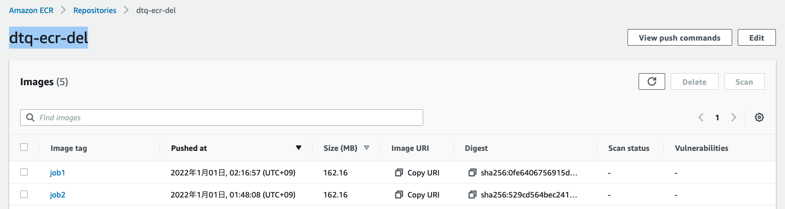
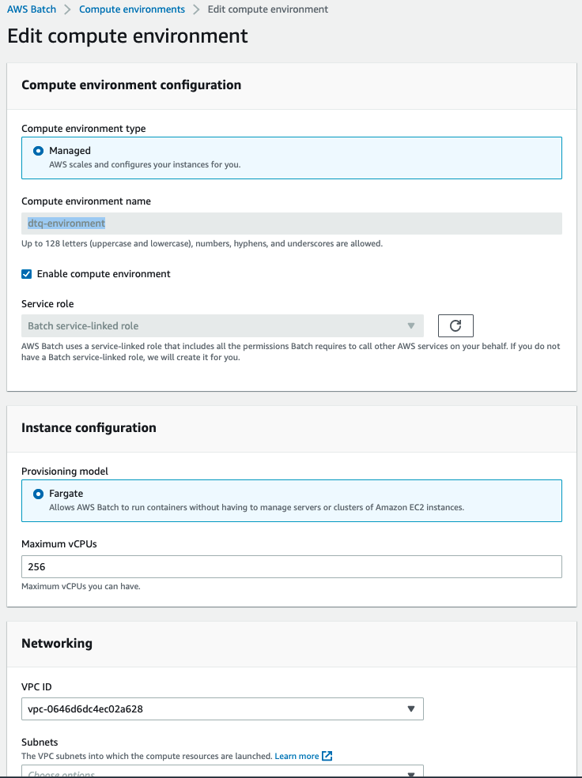
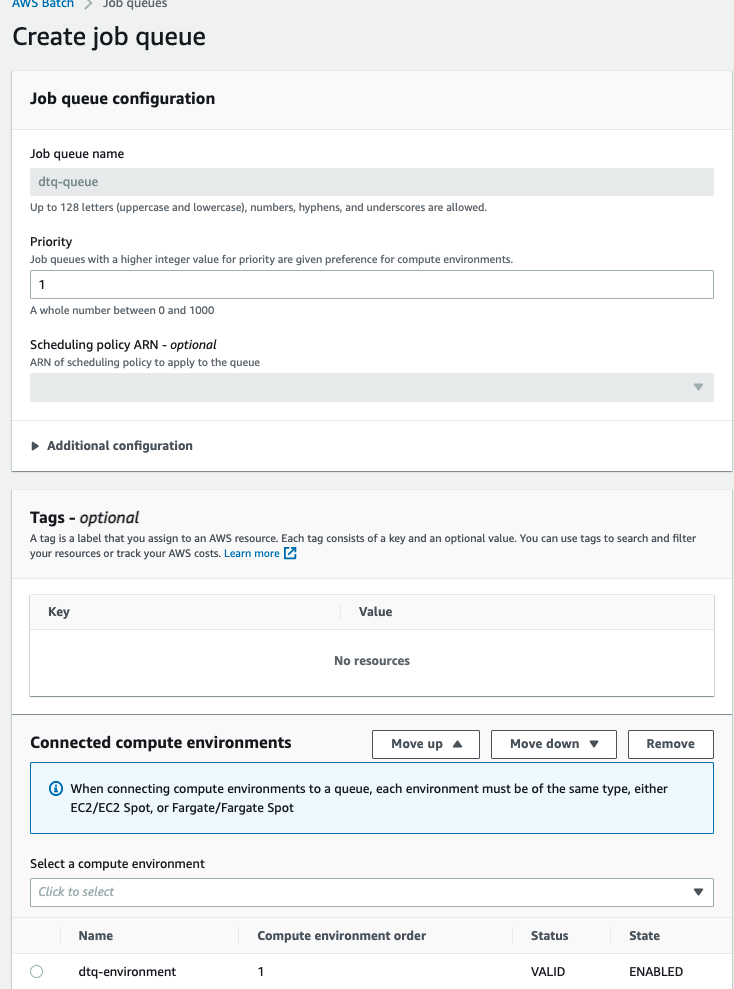
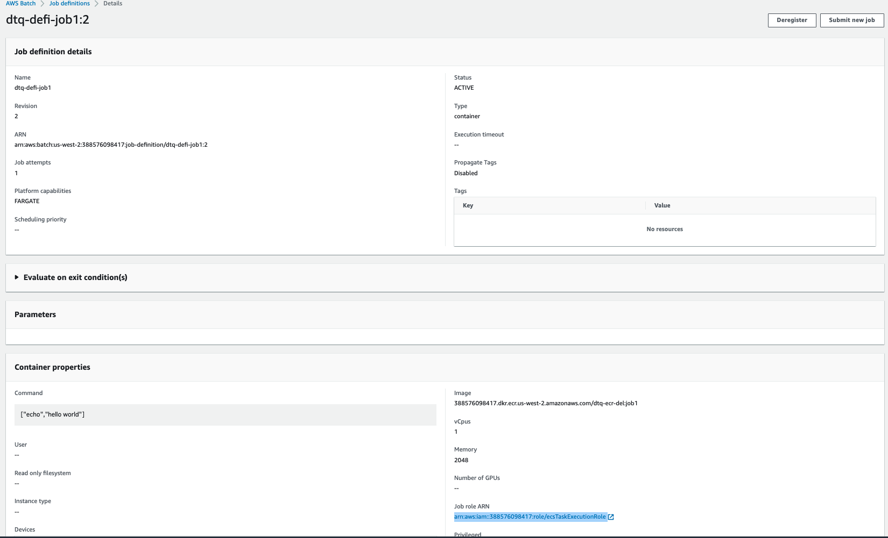
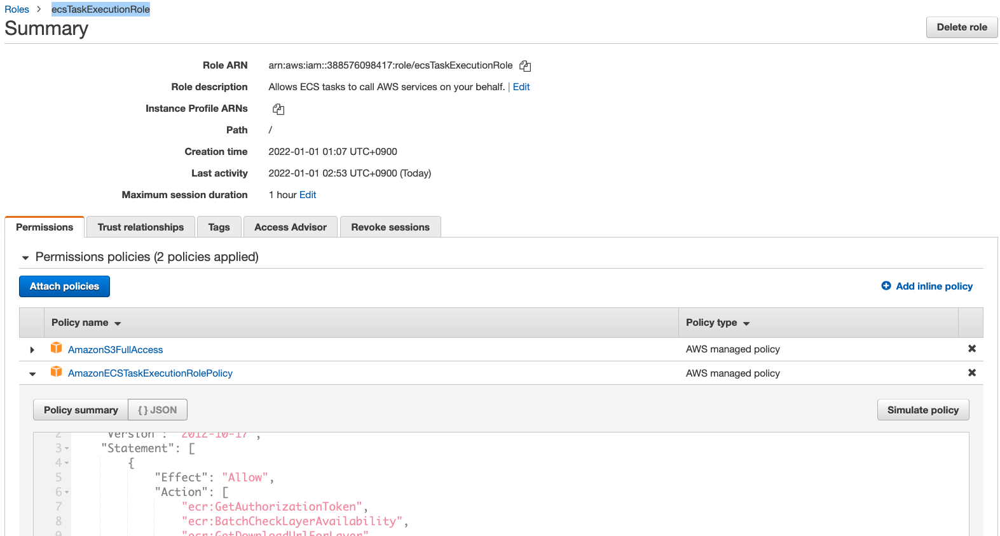
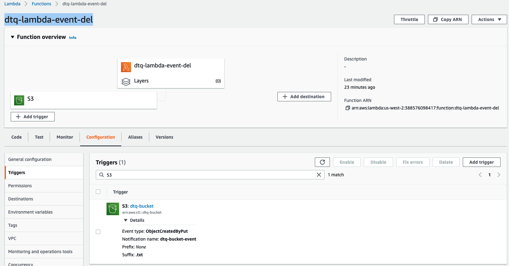
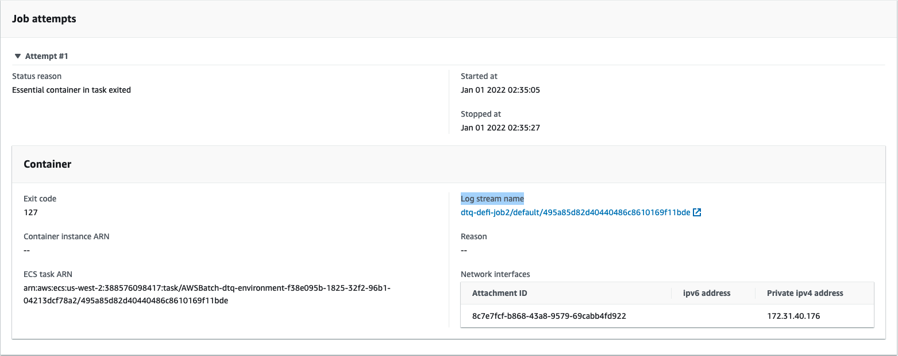

# aws-batch-lambda-s3-color 🐳


[](https://github.com/tquangdo/aws-batch-lambda-s3-color/issues/new)

## reference
[viblo](https://viblo.asia/p/tim-hieu-aws-batch-YWOZrpkR5Q0#_3-demo-2)

## step by atep
### 1/ create bucket: `dtq-bucket`

### 2/ push into ECR
+ ECS: create repo `dtq-ecr-del`
```shell
job1<2># docker build -t job1<2> .
docker tag job1<2> xxx.amazonaws.com/dtq-ecr-del:job1<2>
docker push xxx.amazonaws.com/dtq-ecr-del:job1<2>
```


### 3/ AWS batch
#### 3-1) Create compute environment `dtq-environment`

#### 3-2) Create job queue `dtq-queue`

#### 3-3) Create 2 job definitions `dtq-def-job1<2>`

+ note1: `ecsTaskExecutionRole` must follow with AWS reference

+ note2: `Assign public IP`=ENABLED

### 4/ create lambda `dtq-lambda-event-del`
+ trigger with bucket `dtq-bucket` in ### 1/


### 5/ run
+ upload `color.txt`
+ will output:
1. `mycolor` in the same bucket `dtq-bucket` (💣💣)
2. temp files `line1~line7`
```shell
# aws s3 ls s3://dtq-bucket/
2022-01-01 02:32:29         36 line1
2022-01-01 02:32:29         36 line2
2022-01-01 02:32:27         36 line3
2022-01-01 02:32:27         36 line4
2022-01-01 02:32:29         36 line5
2022-01-01 02:32:29         36 line6
2022-01-01 02:32:28         36 line7
```

### debug (if ERR)
+ will see `dtq-lambda-job2 > FAILED`
+ go to the end of screen `Job attempts` & click to `Log stream name`

+ will see error's detail:
```shell
echo: 1: echo: entrypoint.sh: not found
```
